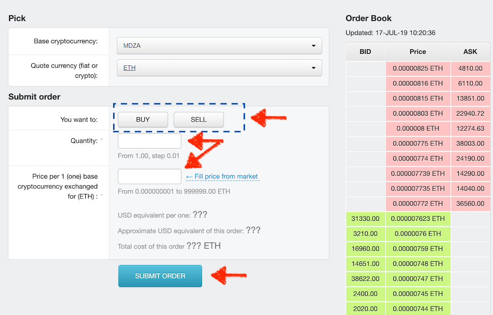

# Buying MDZA on Tokpie exchange

### How to buy MDZA tokens?

Purchase MDZA tokens for ETH, USDT, or WBTC in three simple steps:

1. [Fund](https://tokpie.zendesk.com/hc/en-us/articles/360001325617-4-Fund-your-account) your account with ETH, USDT, or [WBTC](https://tokpie.io/blog/what-is-wrapped-bitcoin-wbtc/). Note that you can [purchase ETH and USDT with a bank card](https://tokpie.io/swap/?crypto=ETH) in a few minutes.
2. Open [MDZA/ETH](https://tokpie.com/view\_exchange/MDZA-ETH/), [MDZA/USDT](https://tokpie.com/view\_exchange/MDZA-usdt/), or [MDZA/WBTC](https://tokpie.com/view\_exchange/MDZA-wbtc/) order book, and place your trade order to **buy**.\
   Use this [instruction](https://tokpie.zendesk.com/hc/en-us/articles/360001325637-5-Buy-or-sell-cryptocurrencies-) if you don’t know how to place a trade order.
3. [Withdraw MDZA](https://tokpie.io/blog/what-is-medooza-mdza-token/#How\_to\_withdraw\_MDZA\_tokens) __ tokens to your personal Ethereum wallet or hold them on the account.

### How to sell MDZA tokens?

To sell MDZA tokens for ETH, USDT, or WBTC, follow three steps:

1. [Deposit MDZA](https://tokpie.io/blog/what-is-medooza-mdza-token/#How\_to\_deposit\_MDZA\_tokens) tokens on your account.
2. Open [MDZA/ETH](https://tokpie.com/view\_exchange/MDZA-ETH/), [MDZA/USDT](https://tokpie.com/view\_exchange/MDZA-usdt/), or [MDZA/WBTC](https://tokpie.com/view\_exchange/MDZA-wbtc/) order book, and place your trade order to **sell**.\
   Read the [instruction](https://tokpie.zendesk.com/hc/en-us/articles/360001325637-5-Buy-or-sell-cryptocurrencies-) if you don’t know how to place a trade order.
3. [Withdraw ETH, USDT, or WBTC](https://tokpie.zendesk.com/hc/en-us/articles/360004531817-How-to-withdraw-cryptocurrencies-from-your-Tokpie-account-) to your personal Ethereum wallet or hold them on your account.

### How to deposit MDZA tokens?

To deposit MDZA tokens on your Tokpie account follow this [guide](https://tokpie.zendesk.com/hc/en-us/articles/360001325617-4-Fund-your-account). Make sure that you are going to deposit MDZA tokens that relate to the smart contract address: 0x0ecdd783dc7bf820614044b51862ed29714d2ba5. If you deposit the wrong tokens, your transfer will not be identified by the Tokpie exchange.

### Tokpie beginners guide

Creating a Tokpie account is the first step towards accessing the services that Tokpie offers.&#x20;

**1.** Go to the official Tokpie site on [**https://tokpie.com/regis/**](https://tokpie.com/regis/)

**2.** Enter your email address.&#x20;

Once you have agreed to our [Terms of Use](https://tokpie.io/terms) and [Privacy Policy](https://tokpie.io/privacy), just click the "Register" button.

**3.** You should receive an activation email containing a confirmation link

If you do not receive an activation (confirmation) email please check the spam folder of your email and if you have not received the email please contact [support](https://t.me/tokpie).

**4.** Confirm your registration by clicking the link in the email.

**5.** Then, you should receive an email containing Your login and automatically generated password.\
We recommend you to change your automatically generated password [here](https://tokpie.com/dashboard/s/schangepassword/1/).

**6.** Congratulations! You have successfully created your Tokpie account and you’re ready to get started.

## Secure your account

Tokpie recommends that you secure your account in the following ways:

**Basic**

* After successful login in Tokpie, replace automatically generated password to own strong password.

Tips:

* Choose a password that's long enough. Minimum of 12 to 14 characters in length.
* Use uppercase characters and capital letters; lowercase characters and small letters.
* Mix meanless words, numbers, and symbols randomly, for example, “E7r9t8@Q#h%Hy+M”

## Get verified

After your [account is created](https://tokpie.zendesk.com/hc/en-us/articles/360001315958-1-Create-an-account), verifying your account will allow funds or bounty stakes to be deposited and trades to be made.

**Note: You don't need to upload any documents for the withdrawal of $25000/daily and $200000/monthly in crypto.**

To become verified:

1. [Log in](https://tokpie.com) to your account.
2. Click on "[Get Verified](https://tokpie.com/dashboard/get\_verified/)" tab.\
   \
   \
   \

3. Verify yourself to your desired tier and view the information needed to do so. Each tier enables more funding options and higher limits.\
   \
   Tier 1. Just fill the [Profile](https://tokpie.zendesk.com/hc/en-us/articles/360007427457-How-to-fill-a-user-Profile-) (no need to upload any documents!)\
   Tier 2. Sign up Tokpie [Cabinet](https://tokpie.io/signup) and [Upload](https://tokpie.io/cabinet/whitelist) the required documents.

Note: US citizens are banned from TOKPIE due to local laws in the US.

## Fund your account

Now that you've [secured](https://tokpie.zendesk.com/hc/en-us/articles/360001325057-2-Secure-your-account) and [verified](https://tokpie.zendesk.com/hc/en-us/articles/360001325597-3-Get-verified-) your account, it’s time to fund it!

Select the [**Balance Details**](https://tokpie.com/dashboard/account\_balance/) tab, then click on \[**+Deposit**] button in the line with an asset you are going to use for funding. The page will look like this:\
\

Also, you can watch an example video showing how to deposit Ethereum.\

You have the option of depositing digital assets/cryptocurrencies and/or [bounty stakes](https://tokpie.zendesk.com/hc/en-us/articles/360007488878-How-to-deposit-bounty-stakes-).

Note: **Tokpie doesn't charge any commissions for depositing**. &#x20;



Note: There are no deposit limits for cryptocurrencies.\
Know [how long it takes to get funds deposited](https://tokpie.zendesk.com/hc/en-us/articles/360012784718) on your account.

## Buy or sell MDZA

Once your account is funded, you can use this guide to place your first MDZA order!

Note: Tokpie provides different ways to place trade orders. To help keep things simple, this article will only cover the fastest way.&#x20;

#### **1. Select MDZA currency pair**

From the [Market Statistics section](https://tokpie.io/#home\_\_markets), you can select any of the trading pairs and click on the related line.

**Type MDZA as The first currency and choose ETH, USTD or WBTC.**

In a Buy order: you pay the quote currency and receive the base currency.

In a Sell order: you sell the base currency and receive quote currency.

**2. Fill out the order form**

In the opened Place Order page:

* Select what you would like to do with base cryptocurrency by impressing \[BUY] or \[SELL] button.
* Enter Quantity of base cryptocurrency
* Enter the Price per 1 (one) base cryptocurrency\
  Note: You can fill the price field automatically with the best available BID/ASK **market price** by clicking on the "Fill price from market" element.

#### **3. Submit order**

After things look good you just need to press the large \[SUBMIT ORDER] button.

#### **4. Wait for order execution**

If a **market price** is selected, the trade will happen instantly and your [balance](https://tokpie.com/dashboard/account\_balance/) will change. Funds can be withdrawn or used to trade again right away. You can view successfully executed (Matched!) trade orders on the "[My Orders](https://tokpie.com/dashboard/s/kuserrequests/)" tab.

If a market price is not selected, trade order **** may not be executed (matched) right away but you can view its status in the "[My Orders](https://tokpie.com/dashboard/s/kuserrequests/)" tab and in the Order book. In the below example, the OMG/ETH price would have to fall for the buy order to be executed.

#### **5. Fees**
