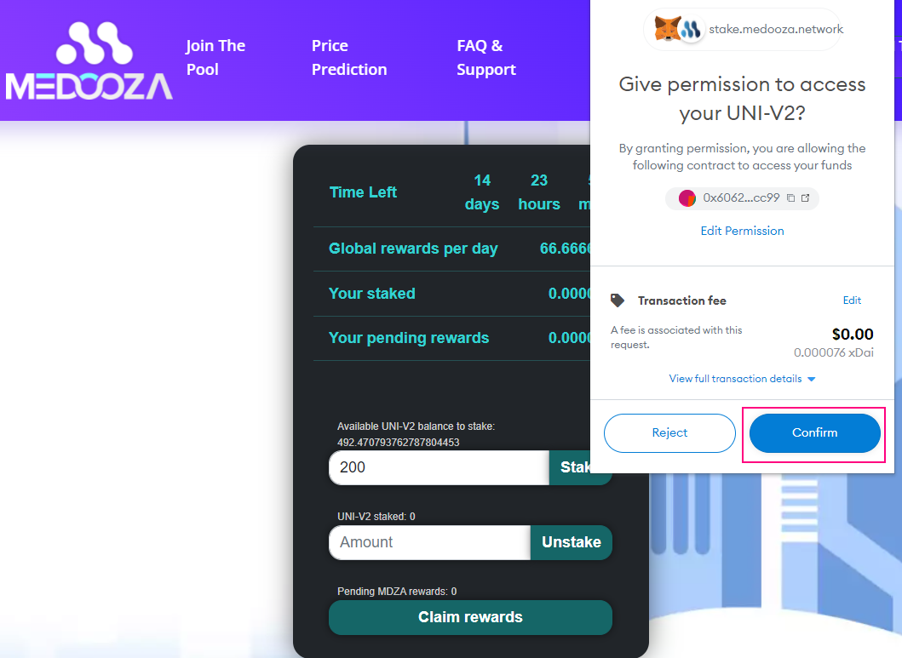

# Medooza Stake program

### Overview


Join the Medooza stake program


Medooza stake program allows You to earn up to 35.5% APY + a special bonus. The program runs in 30 day cycle. You can claim the reward without penalty after the cycle is finished or at any time but without rewards. The reward is paid in MDZA.

### Step 1

Be sure You have added some liquidity to [MDZA/XDAI](https://app.honeyswap.org/#/add/0xbab3cbdcbcc578445480a79ed80269c50bb5b718/xDAI?chainId=100) poll on [Honeyswap](https://app.honeyswap.org/#/add/0xbab3cbdcbcc578445480a79ed80269c50bb5b718/xDAI?chainId=100). Once You provide some liquidity, Youll get that some LPT (liquidity provider token) This is (LPT) what You going to stake.

.png>)


Important! Only this pair participates in the program.


### Step 2

Connect the account with which You provided liquidity to the staking program.

.png>)

If all is done right, You should see the following window:

.png>)


1. The available amount of LPT token You can stake.
2. Additional global reward per day.


### Step 3

Enter the amount of token You wish to stake. Press on the "stake" button

.png>)

Metamask will prompt with an additional popup window, please confirm the transaction

Where the transaction is approved, You will see the following &#x20;

.png>)

Congratulation! All are done and You started to earn!!
